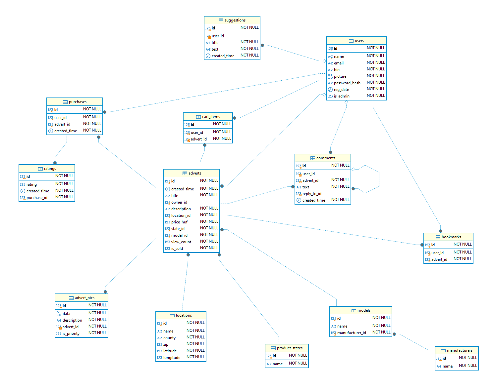
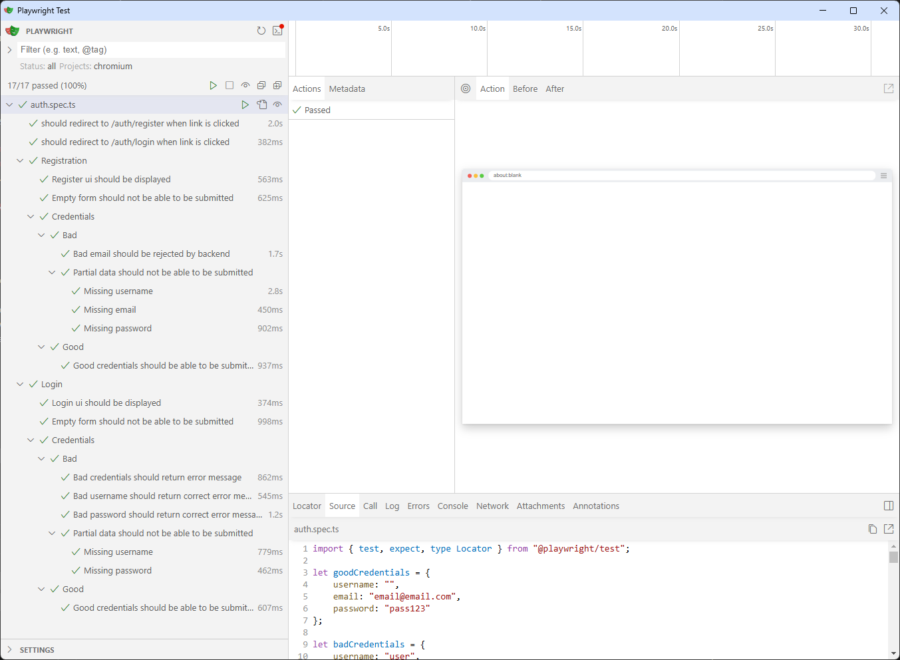
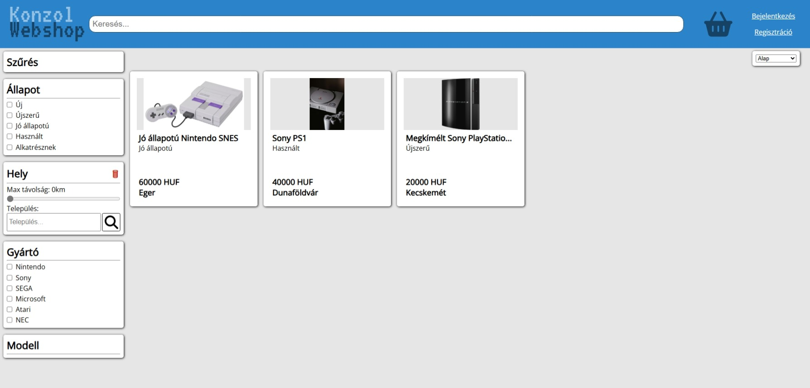

<style>
body {
    background-color: #fff;
    color: #111;
    font-family: Arial, Helvetica, sans-serif;
}

a {
    color: black;
    text-decoration-color: blue;
}

/* TOC */
ul:nth-of-type(1) a {
    line-height: 1.4rem;
}

a:hover {
  background-color: black;
  color: white;
}

a:hover code {
  background-color: black !important;
  color: white !important;
}

h1,h2,h3,h4,h5,h6 {
    color: darkblue;
}

code, pre * {
    font-family: 'Courier New', Courier, monospace;
    background-color: #f5f2f0 !important;
    color: black;
}

h2 {
    border-bottom: 1px solid darkblue;
}

img {
  max-width: 100%;
  margin-top: 10px;
  margin-bottom: 10px;
}
</style>

<!-- @import "[TOC]" {cmd="toc" depthFrom=1 depthTo=6 orderedList=false} -->

<!-- code_chunk_output -->

- [Konzol webshop dokumentáció](#konzol-webshop-dokumentáció)
  - [Bevezetés](#bevezetés)
    - [Témaválasztás indoklása](#témaválasztás-indoklása)
    - [Záródolgozatom témája, mégis milyen funkciókat foglal magába?](#záródolgozatom-témája-mégis-milyen-funkciókat-foglal-magába)
    - [Sajátosságok](#sajátosságok)
  - [Fejlesztői dokumentáció](#fejlesztői-dokumentáció)
    - [Felhasznált programozási nyelvek és keretrendszerek](#felhasznált-programozási-nyelvek-és-keretrendszerek)
      - [Backend](#backend)
      - [Frontend](#frontend)
    - [Fejlesztői környezet](#fejlesztői-környezet)
      - [Github és git](#github-és-git)
      - [Tesztelési keretrendszerek](#tesztelési-keretrendszerek)
    - [Kialakított adatszerkezet](#kialakított-adatszerkezet)
      - [Adatbázis táblái](#adatbázis-táblái)
        - [A `locations` tábla](#a-locations-tábla)
        - [A `manufacturers` tábla](#a-manufacturers-tábla)
        - [A `product_states` tábla](#a-product_states-tábla)
        - [A `users` tábla](#a-users-tábla)
        - [A `models` tábla](#a-models-tábla)
        - [A `suggestions` tábla](#a-suggestions-tábla)
        - [Az `adverts` tábla](#az-adverts-tábla)
        - [A `bookmarks` tábla](#a-bookmarks-tábla)
        - [A `cart_items` tábla](#a-cart_items-tábla)
        - [A `comments` tábla](#a-comments-tábla)
        - [A `purchases` tábla](#a-purchases-tábla)
        - [A `ratings` tábla](#a-ratings-tábla)
        - [Az `advert_pics` tábla](#az-advert_pics-tábla)
    - [Algoritmusok a backend és frontend megvalósításban](#algoritmusok-a-backend-és-frontend-megvalósításban)
      - [Felhasználó regisztrációs folyamat backend oldal](#felhasználó-regisztrációs-folyamat-backend-oldal)
      - [Felhasználó regisztrációs folyamat frontend oldal](#felhasználó-regisztrációs-folyamat-frontend-oldal)
      - [Felhasználó belépési folyamat backend oldal](#felhasználó-belépési-folyamat-backend-oldal)
      - [Felhasználó belépési folyamat frontend oldal](#felhasználó-belépési-folyamat-frontend-oldal)
      - [Hirdetés feltöltési folyamat backend oldal](#hirdetés-feltöltési-folyamat-backend-oldal)
      - [Hirdetés feltöltési folyamat frontend oldal](#hirdetés-feltöltési-folyamat-frontend-oldal)
      - [Keresési folyamat backend oldal](#keresési-folyamat-backend-oldal)
      - [Keresési folyamat frontend oldal](#keresési-folyamat-frontend-oldal)
    - [Különböző körülmények, esetek és hibakezelések](#különböző-körülmények-esetek-és-hibakezelések)
      - [Hirdetések hiánya](#hirdetések-hiánya)
      - [Hirdetés módosításának hibalehetőségei](#hirdetés-módosításának-hibalehetőségei)
      - [Túl nagy vagy hibás kép feltöltése](#túl-nagy-vagy-hibás-kép-feltöltése)
      - [Hirdetés kosárhoz adása közbeni hibák](#hirdetés-kosárhoz-adása-közbeni-hibák)
    - [Fejlesztési lehetőségek](#fejlesztési-lehetőségek)
  - [Teszt dokumentáció](#teszt-dokumentáció)
    - [Backend tesztek](#backend-tesztek)
    - [Frontend tesztek](#frontend-tesztek)
  - [Felhasználói dokumentáció](#felhasználói-dokumentáció)
    - [Üdvözöllek!](#üdvözöllek)
    - [Szükséges eszközök a weboldal használatához](#szükséges-eszközök-a-weboldal-használatához)
    - [Weboldal eléréséhez használható böngészők](#weboldal-eléréséhez-használható-böngészők)
    - [Weboldal használatának részletes ismertetése](#weboldal-használatának-részletes-ismertetése)
      - [A regisztráció folyamatának ismertetése](#a-regisztráció-folyamatának-ismertetése)
      - [A belépés folyamatának ismertetése](#a-belépés-folyamatának-ismertetése)
      - [Hirdetés feltöltés folyamatának ismertetése](#hirdetés-feltöltés-folyamatának-ismertetése)
      - [Hirdetés keresés folyamatának ismertetése](#hirdetés-keresés-folyamatának-ismertetése)
      - [Hirdetés vásárlás folyamatának ismertetése](#hirdetés-vásárlás-folyamatának-ismertetése)
  - [Összefoglalás](#összefoglalás)
    - [Elkészült munkánk értékelése](#elkészült-munkánk-értékelése)
  - [Irodalomjegyzék](#irodalomjegyzék)

<!-- /code_chunk_output -->

<div style="page-break-after: always;"></div>

# Konzol webshop dokumentáció

## Bevezetés

### Témaválasztás indoklása
A konzol árusító oldal ötlete a csapat videójátékok iránti szenvedélyéből ered. A webshop ötlet már hamar felmerült, viszont a játékkonzolos fő téma csak később került szóba. Miután eldöntöttük a fő témát, tanáraink segítségét kértük a különböző funkciók eldöntéséhez. Az eredi ötletünk csak a különleges szűrési megoldást tartalmazta, de végül kialakult egy megvalósítható funkció lista.

### Záródolgozatom témája, mégis milyen funkciókat foglal magába?
Egy videójáték konzolok árusítására specializálódott internetes áruház, ahol felhasználók feltölthetnek hirdetéseket, illetve böngészhetnek azok között. A weboldal fő funkciói közé tartozik a felhasználói profil regisztrációja és testreszabása, a hirdetések közzétéle, a hirdetések részletes keresése.

### Sajátosságok
Weboldalunk fő sajátossága más felhasználók által vezérelt áruházzal szemben a részletes szűrési lehetőség a hirdetések létrehzása és keresése közben. Ez a rendszer lehetővé teszi, hogy a felhasználók könnyedén megtalálják azokat a hirdetéseket amelyek a számukra megfelelőek.

## Fejlesztői dokumentáció

### Felhasznált programozási nyelvek és keretrendszerek

#### Backend
- <ins>Nest.js</ins>
  - Programozási nyelv: Typescript/Javascript 

#### Frontend
- <ins>SvelteKit</ins>
  - Programozási nyelv: Typescript/Javascript, SCSS/CSS

### Fejlesztői környezet

#### Github és git
Projektmunkánk során verziókezelőként a Git rendszerét választottuk, amelyet online a Github szolgáltalásaival tárolunk. Ezzel nagyban megkönyítettük a fejlesztési folyamatot és a változtatások egymással való megosztását.

#### Tesztelési keretrendszerek
- **Backend: Pytest**
  - A Pytest egy, a python programozási nyelven alapuló tesztelési keretrendszer amellyel bárki létre tud hozni testreszabott teszteket egyszerűen.
- **Frontend: Playwright**
  - A Playwright egy úgynevezett "End-to-End" tesztelési keretrendszer, amellyel egyszerűen tudjuk tesztelni a weblapjainkat a felhasználók szemszögéből, ezzel biztosítva a megfelelő kinézetet és viselkedést.

### Kialakított adatszerkezet
#### Adatbázis táblái



##### A `locations` tábla
A `locations` tábla tárolja el az eladni kívánt termékek lehetséges helyeit.
Ez a tábla statikus adatok tárolására szolgál, futás közben nem módosul, hanem induláskor töltődik be.
Eltároljuk a település nevét, megyéjét és irányítószámá. Ezek a keresést teszik lehetővé.
A koordináták segítségével ki tudjuk számolni a távolságokat. [Ez a keresési folyamat során történik meg](#keresési-folyamat-backend-oldal).

##### A `manufacturers` tábla
Itt tároljuk ez a gyártókat, amik a modellekhez kapcsolódnak.

##### A `product_states` tábla
Szintén a keresést segító tábla, a termékek lehetséges állapotjait tárolja.

##### A `users` tábla
Az egyik legfontosabb tábla, a felhasználói profilok legfőbb adatait tárolja.
Ezek az adatok a név, e-mail cím, profil leírás, profilkép, a jelszó hash és az, hogy a felhasználó adminisztrátor-e.
Hozzá kapcsolódnak a létrehozott hirdetések, hozzászólások, vásárlások, könyvjelzők, a kosár és a javaslatok.

##### A `models` tábla
A termékek lehetséges modelljei, amik a szűrés fő szempontjai.

##### A `suggestions` tábla
Felhasználók által tett javaslatok. Ezeket bárki létrehozhatja, de csak az adminisztrátori joggal rendelkező felhasználók olvashatják.

##### Az `adverts` tábla
A létrehozott hirdetéseket tartalmazza. Tárolja a címet, leírást, létrehozó felhasználót, a termék helyét, állapotát, árát és a modellt.
Ezek mellett azt is tárolja, hogy a termék eladottnak lett-e már jelölve.
A nézettségi számot is tárolja, ami minden olyan alkalomman növekszik, amikor egy felhasználó megnézi a hirdetést. Ez egy nagyszerű mód arra, hogy az eladók felmérjék termékeik népszerűségét.

##### A `bookmarks` tábla
A felhasználók képesek hirdetéseket későbbre elmenteni könyvjelzőzés segítségével.

##### A `cart_items` tábla
A kosárba helyezett elemeket is az adatbázisban tároljuk. Ezeket a termékeket meg tudja vásárolni a vevő.

##### A `comments` tábla
A hirdetések alatt lehetséges hozzászólásokat közzétenni. Ezekben további információkat kérdezhetünk meg az eladótól. Eltároljuk nem csak azt, hogy melyik hirdetés alatt hagyták a kommentet, hanem azt is, hogy melyik másik hozzászólásra válaszoltak.

##### A `purchases` tábla
A kosárba helyezett termékeket megvásárolhatjuk, ebben a táblában az eddigi vásárlásokat tároljuk.

##### A `ratings` tábla
A vásárlás után lehetőségünk van a terméket és az eladó által nyújtott szolgáltatást értékelni. Eltároljuk, hogy melyik vásárláshoz kapcsolódik az értékelés, valamint annak értékét.

##### Az `advert_pics` tábla
A vásárlóknak lehetőségük van a hirdetésekhez több képet csatolniuk. Maga a kép mellett egyéb adatokat is tárolunk a táblában. A képekhez lehet hozzáadni leírást is. Beállítható, hogy melyik legyen a fő kép, vagyis amelyik a hirdetés listázásakor megjelenik.

### Algoritmusok a backend és frontend megvalósításban

#### Felhasználó regisztrációs folyamat backend oldal
Egy felhasználó regisztrációja a bejelentkezés alapfeltétele. Ez után válik használhatóvá a bejelentkező képernyő és vele együtt a bejelentkezett felhasználóknak nyújtott funkciók.

A regisztrációt a backend a `POST /api/user` request segítségével biztosítja. Az adatokat érzékenységük miatt természetesen a kérés body-jában fogadja, HTTPS titkosításra hagyadkozva. Hibakezelés után létrehozza a felhasználót, majd visszaadja az id-jét.

A kérés elküldése után ez a kódrészlet fut le:

```ts
// TODO: Nem végleges
async create(dto: CreateUserDto): Promise<number> {
  if (await this.userRepository.existsBy({ name: dto.name })) {
    throw new BadRequestException('Username is taken');
  }
  let passHash = await UserService._hashPass(dto.password);
  let toInsert = new User(dto.name, dto.email, passHash, getIsoDate());
  let result = await this.userRepository.insert(toInsert);
  return result.identifiers[0].id;
}
```

Először a felhasználónév foglaltságát ellenőrizzük. Ez után a jelszó hashelése történik.
Így elkerüljük a jelszó az adatbázisban szövegként történő tárolását.
Létrehozzuk a beillesztendő entity-t, majd eltároljuk az adatbázisban.
Az eltárolt sor id-jét visszaadjuk.

#### Felhasználó regisztrációs folyamat frontend oldal
A regisztrációs felület az `/auth/register` aloldalon érhető el. Ez az oldal a bejelentkezés oldallal egybefűzött, így ez a két oldal szinte ugyan az.

A form kódja a következő:
```html
<form method="post">
  <h1>{data.action === "login" ? "Bejelentkezés" : "Regisztráció"}</h1>
  <div class="group">
      <label for="name">Felhasználó név</label>
      <input autofocus type="text" id="name" name="name" required maxlength="20" on:change={limitTo20} />
  </div>

  {#if data.action === "register"}
      <div class="group">
          <label for="email">E-mail</label>
          <input type="email" id="email" name="email" required />
      </div>
  {/if}

  <div class="group">
      <label for="password">Jelszó</label>
      <input type="password" name="password" id="password" required />
  </div>

  <span id="error">{form?.message || ""}</span>

  {#if data.action === "login"}
      <a href="register">Regisztráció</a>
  {/if}

  <input
      type="submit"
      formaction="?/{data.action}"
      value={data.action === "login" ? "Bejelentkezés" : "Regisztráció"}
  />
</form>
```

A `data` változót tartalmazza az URL utolsó szekcióját, az úgynevezett `action` változót.

A form leadása után a következő kódrészlet fut le:

```ts
register: async ({ cookies, request }) => {
    const data = await request.formData();
    const username = data.get("name");
    const password = data.get("password");
    const email = data.get("email");

    console.log(username, password, email);

    if (username === null || password === null || email === null) return { message: "Invalid input" };

    console.log(`${apiPath}/user/create`);

    const res = await fetch(`${apiPath}/user`, {
        method: "POST",
        headers: {
            "Content-Type": "application/json"
        },
        body: JSON.stringify({
            name: username,
            password,
            email
        })
    });
    if (res.ok || res.status == 201) {
        return redirect(302, "/auth");
    }
    const body = await res.json();
    return { message: body.message };
}
```

Az oldal bejelentkezés után nem elérhető. Ezt minden betöltésnél a `LayoutServerLoad` funkció teszi lehetővé.

```ts
export const load: LayoutServerLoad = async ({ cookies }) => {
    const token = cookies.get("token");
    if (token != undefined) {
        return redirect(302, "/");
    }
};
```

#### Felhasználó belépési folyamat backend oldal
Belépett felhasználók a hirdetések megtekintésén és keresésén kívül sok más funkciót is elérhetnek.

A belépést a backend a `POST /api/auth/login` request segítségével biztosítja. Az adatok itt is a body-ban kerülnek továbbításra.

Ha a belépési adatok helyesek, egy token-t adunk vissza. A továbbiakban ez lesz használható a bejelentkezést igénylő funkciók eléréséhez.

```ts
// TODO: Nem végleges
async logIn(username: string, password: string) {
  const hash = await this.usersService._getPassHashFromName(username);
  if (hash == null) {
    throw new UnauthorizedException('No such user');
  }
  if (!(await bcrypt.compare(password, hash))) {
    throw new UnauthorizedException('Invalid password');
  }

  const userId = await this.usersService._getIdFromName(username);
  const isAdmin = await this.usersService._getIsAdminFromName(username);

  return {
    access_token: await this.jwtService.signAsync(
      { username, id: userId, isAdmin },
      { secret: jwtConstants.secret },
    ),
  };
}
```

Az adabázisból lekérjük a jelszó hashet. Ha ez nem létezik, vagy nem egyezik a felhasználó által megadott jelszóval, `401 Unauthorized` hibát adunk vissza.

Lekérjuk a felhasználó azonosítóját és az admin jogot tároló értéket. Ezek után legeneráljuk a token-t és visszaadjuk.

A bejelentkezést igénylő endpointokat a következő decoratorral jelölhetjük meg: `@UseGuards(JwtAuthGuard)`.
A tokent-t a guard-ban a következő módon használjuk fel:

```ts
// TODO: Nem végleges
async canActivate(context: ExecutionContext): Promise<boolean> {
  const request = context.switchToHttp().getRequest();
  const token = this.extractTokenFromHeader(request);
  if (!token) {
    throw new UnauthorizedException();
  }
  let payload: any;
  try {
    payload = await this.jwtService.verifyAsync(token, {
      secret: jwtConstants.secret,
    });
  } catch {
    throw new UnauthorizedException();
  }

  const onlyAllowAdmin = this.reflector.get(
    IS_ADMIN_ONLY_KEY,
    context.getHandler(),
  );

  if (onlyAllowAdmin && !payload.isAdmin) {
    throw new ForbiddenException();
  }

  request['user'] = payload;
  return true;
}
```

A tokent visszaalakítjuk a payloaddá, majd ellenőrzéseket végzünk rajta. Egy másik decorator segítségével endpointokat csak admin által elérhetővé tehetünk. Ha ez az endpoint ilyen, ellenőrizzük, hogy a felhasználó admin-e. Ha a token rossz, hibát adunk vissza.

#### Felhasználó belépési folyamat frontend oldal
A bejelntkezési felület az `/auth/login` aloldalon érhető el. Ez az oldal a regisztrációs oldallal egybefűzött, így ez a két oldal szinte ugyan az.

A form kódja a következő:
```html
<form method="post">
  <h1>{data.action === "login" ? "Bejelentkezés" : "Regisztráció"}</h1>
  <div class="group">
      <label for="name">Felhasználó név</label>
      <input autofocus type="text" id="name" name="name" required maxlength="20" on:change={limitTo20} />
  </div>

  {#if data.action === "register"}
      <div class="group">
          <label for="email">E-mail</label>
          <input type="email" id="email" name="email" required />
      </div>
  {/if}

  <div class="group">
      <label for="password">Jelszó</label>
      <input type="password" name="password" id="password" required />
  </div>

  <span id="error">{form?.message || ""}</span>

  {#if data.action === "login"}
      <a href="register">Regisztráció</a>
  {/if}

  <input
      type="submit"
      formaction="?/{data.action}"
      value={data.action === "login" ? "Bejelentkezés" : "Regisztráció"}
  />
</form>
```

A `data` változót tartalmazza az URL utolsó szekcióját, az úgynevezett `action` változót.

A form leadása után a következő kódrészlet fut le:

```ts
login: async ({ cookies, request }) => {
    //TODO debug
    const data = await request.formData();
    const username = data.get("name");
    const password = data.get("password");

    if (username === null || password === null) return { message: "Invalid input" };

    const res = await fetch(`${apiPath}/auth/login`, {
        method: "POST",
        headers: {
            "Content-Type": "application/json"
        },
        body: JSON.stringify({
            name: username,
            password
        })
    });

    const body = await res.json();

    if (res.status == 201) {
        //TODO
        cookies.set("token", body.access_token, {
            path: "/",
            maxAge: 60 * 60,
            httpOnly: true,
            sameSite: "strict",
            secure: false
        });
        return redirect(302, "/");
    }
    return { message: body.message };
}
```

Az oldal bejelentkezés után nem elérhető. Ezt minden betöltésnél a `LayoutServerLoad` funkció teszi lehetővé.

```ts
export const load: LayoutServerLoad = async ({ cookies }) => {
  const token = cookies.get("token");
  if (token != undefined) {
      return redirect(302, "/");
  }
};
```

#### Hirdetés feltöltési folyamat backend oldal
A hirdetések feltöltése az oldal legfontosabb funkciója. A feltöltéskor megadhatjuk az eladni kívánt termék adatait, árát, leírását és annak helyét.
A videójáték-konzol modellének megadása a webáruház egyik fő sajátossága. Segítségével egyértelműen megjelölhetjük a terméket.
És keresésnél a modell vagy gyártó segít megtalálni a számunkra megfelelő hirdetéseket. 

#### Hirdetés feltöltési folyamat frontend oldal
A hirdetés feltöltésére szolgáló oldalt az `advert/create` címen érhetjük el, vagy az "Új hirdetés" menüpontra kattintva a felhasználói menüben.
Az oldalon egy négy részre osztott felhasználói felület tárul elénk.
- Az első rész, amely bal-felül található a hirdetéshez tartozó képek  két féle módon történő feltöltésére szolgál
  - A plussz (+) gombra kattintva az böngésző segítségével kiválaszthatunk képeket amelyeket fel akarunk tölteni.
    - A `handleFiles` eseménykezelő függvény fut le ebben az esetben. Itt ellenőrizzük a fájl méretét, ugyanis a backend 50MB méretnél nagyobb fájlokat nem fogad el. Mindez után a képet Base64 formátumba alakítjuk és elhejezzük a kiválaszott képek listájában.
      ```ts
      async function handleFiles(event: Event | DragEvent) {
        event.preventDefault();

        const target = event.target as HTMLInputElement;

        let eventFiles: FileList | null | undefined;

        if (event instanceof DragEvent) {
            eventFiles = event.dataTransfer?.files;
        } else {
            eventFiles = target.files;
        }

        if (!eventFiles) return;

        for (const file of eventFiles) {
            if (file.size > 50000000) {
                alert("Valamely fájlok mérete túl nagy!");
                return;
            }
        }

        for (let i = 0; i < eventFiles.length; i++) {
            const file = eventFiles[i] as File;
            const base64 = await file.arrayBuffer().then(buffer => Buffer.from(buffer).toString("base64"));
            const image = new Image();
            image.src = "data:image/jpeg;base64," + base64;
            image.onload = () => {
                let localFiles = [];
                localFiles.push({ base64, aspect: `${image.width} / ${image.height}` });
                imageFiles = [...imageFiles, ...localFiles];
                console.log(imageFiles);
            };
        }
        target.files = null;
      }
      ```
  - A fájlokat a szekcióra dobva (Drag&Drop) a mozgatott fájlok feltöltésre kerülnek
    - Az `imageDrop` eseménykezelő függvény fut le ebben az esetben. Itt ellenőrizzük a fájl méretét, ugyanis a backend 50MB méretnél nagyobb fájlokat nem fogad el. Mindez után a képet Base64 formátumba alakítjuk és elhejezzük a kiválaszott képek listájában.
    ```ts
    async function imageDrop(e: DragEvent) {
        e.preventDefault();

        const target = e.target as HTMLInputElement;

        let eventFiles: FileList | null | undefined;

        if (e instanceof DragEvent) {
            eventFiles = e.dataTransfer?.files;
        } else {
            eventFiles = target.files;
        }

        if (!eventFiles) return;

        for (const file of eventFiles) {
            if (file.size > 50000000) {
                alert("Valamely fájlok mérete túl nagy!");
                return;
            }
        }

        for (let i = 0; i < eventFiles.length; i++) {
            const file = eventFiles[i] as File;
            const base64 = await file.arrayBuffer().then(buffer => Buffer.from(buffer).toString("base64"));
            const image = new Image();
            image.src = "data:image/jpeg;base64," + base64;
            image.onload = () => {
                let localFiles = [];
                localFiles.push({ base64, aspect: `${image.width} / ${image.height}` });
                imageFiles = [...imageFiles, ...localFiles];
                console.log(imageFiles);
            };
        }
        target.files = null;
    }
    ```
- A második rész, amely a kép feltöltéstől jobbra helyezkedik el, a hirdetés fő adatainak feltöltésére szolgál.
  - A cím megadása, amely a `limitTo100` függvény segítségével 100 karakternél nem lehet hoszabb.
    ```ts
    function limitTo100(e: Event) {
        if (!e?.target) return;
        if ((e.target as HTMLInputElement).value.length > 100) {
            (e.target as HTMLInputElement).value = (e.target as HTMLInputElement).value.slice(0, 100);
        }
    }
    ```
  - A hirdetés árát, amelyet 0 és 10000000 között tart a kód.
  - A hirdetés gyártóját és állapotát, melyeket a backend által megadott opciók közül választhatóak ki
  - A hirdetés modelljét, amelyeket az után kérünk le, miután a felhasználó kiválaszott egy gyártót
    ```ts
    async function manufacturerSelect() {
        const res = await fetch(`${apiPath}/filters/modelsForManufacturer?manufacturerId=${brandId}`);
        const data = await res.json();
        models = data;
    }
    ```
- A harmadik rész, amely az előző kettő alatt helyezkedik el, a leírás megadásához szolgáló szövegdobozt tartalmazza.
  - A leírás megadásánál lehetőségünk van markdown segítségével formázni a megadott szöveget. Ehhez segítségül a "Carta" nevű csomagot használjuk, amely tartalmaz egy Markdown szövegszerkesztőt.
  - A leírás hossza maximum 1000 karakter lehet, amelyet a Svelte segítségével ellenörzünk minden változtatás után.
#### Keresési folyamat backend oldal
A hirdetések keresése tetszőlegesen cím alapján is történhet, de emellett szűrők is rendelkezésre állnak.
A gyártón és modellen kívül a hely alapján is kereshetünk. Beállíthatjuk, hogy egy adott település körüli területen belüli hirdetéseket lássuk.
Egy másik fontos tényező a termék állapota, pl. Újszerű vagy Jó állapotú.
Azt is megadhatja a felhasználó, hogy az árak milyen értékek közöttiek lehetnek.

A következő kódrészlet összegyűjti azokat a településeket, amelyek a megadott területen belül helyezkednek el. Az ezeken a településeken lévő termékeket adjuk vissza találatként.

```ts
async _findLocationIdsInArea(
  lat: number,
  long: number,
  maxDist: number,
): Promise<Array<number>> {
  const results = (
    (await this.locationRepository
      .createQueryBuilder()
      .addSelect('id')
      .addSelect(
        `
          3959 * acos (
            cos ( radians(${lat}) )
            * cos( radians( latitude ) )
            * cos( radians( longitude ) - radians(${long}) )
            + sin ( radians(${lat}) )
            * sin( radians( latitude ) )
          )
        `,
        'distance',
      )
      .having('distance <= :maxDist', { maxDist })
      .getRawMany()) as Array<Location>
  ).map((x) => x.id);
  return results;
}
```

Az alábbi kód pedig a gyártók és modellek alapján való kereséshez kapcsolódik.
Ha egy gyártót kapunk, akkor az azon belüli minden modell visszaadandó.
Viszont ha gyártó mellett ahhoz tartozó modelleket is megkapunk, nem az összes modellt, hanem csak a megadottakat nézzük.

```ts
async _findPossibleModelIds(dto: FindAdvertsDto) {
  let results: Number[] = [];

  let passedModels = await this.modelRepository.findBy({
    id: In(dto.modelIds ?? []),
  });
  for (const manufactId of dto.manufacturerIds ?? []) {
    const passedModelsForManufact = passedModels.filter(
      (x) => x.manufacturerId == manufactId,
    );
    passedModels = passedModels.filter(
      (x) => !passedModelsForManufact.includes(x),
    );
    if (passedModelsForManufact.length == 0) {
      results = results.concat(
        await this._findModelIdsOfManufacturer(manufactId),
      );
    } else {
      results = results.concat(passedModelsForManufact.map((x) => x.id));
    }
  }
  for (const model of passedModels) {
    results.push(model.id);
  }
  return results;
}
```

A keresési paraméterek előkészítése után lefuttatjuk a keresést.
Pagináció használatával adjuk vissza az eredményeket. A `skip` paraméter a kihagyott találatok, a `count` pedig a visszaadandó találatok száma.
Az összes (tehát pagináció nélküli) találatok számát is betöltjük.

```ts
const found = await this.advertRepository.find({
  where,
  order,
  skip: dto.skip,
  take: dto.count,
});
const resultCount = await this.advertRepository.count({ where });

let output = new FindAdvertsResultDto();
output.items = found as any;
output.resultCount = resultCount;
```

#### Keresési folyamat frontend oldal
A hirdetések kereséséhez egy szűrési rendszert alakítottunk ki, amely alapja a hirdetések pontos keresésének. A szűrő paramétereit a backend egy végponton keresztül teszi elérhetővé, így könnyen bővíthető, és jövőbiztos. Szűrőkön felül a felahsználó képes a hirdetések címére is keresni a keresőmeő segítségével.

Egyik legtöbb munkát igénylő szűrő a távolságon alapuló kiválasztás volt. A felhasználó kiválaszthat egy adott magyarországi települést, majd a maximális távolságot, amin belüli hirdetéseke szereté látni. Ennek megvalósítására saját Svelte komponenst hoztunk létre, amely segítségével könnyedén kiválasztható egy település a település listából.
Amikor a felhasználó elindítja a keresést egy megadott szöveggel, a backend egy település listát szolgáltat, amelyből kiválaszthatunk egyet.
```ts
async function search() {
    if (textBoxValue.length === 0) {
        return;
    }
    showResults = true;
    loading = true;

    const resp = await fetch(`${apiPath}/filters/locations?query=${encodeURIComponent(textBoxValue)}`);
    locations = await resp.json();

    loading = false;
}
```
Miután megjelent a lehetséges települések listája a felhasználó kattintással, vagy akár a billentyűzeten található nyilakkal is választhat egyet. Ezt egy saját `keydown` eseménykezelő teszi lehetővé.
```ts
const keyDownHandler = (e: KeyboardEvent) => {
    if (e.key === "ArrowDown") {
        e.preventDefault();
        if (selectedResult < locations.length - 1) {
            selectedResult++;
        }
    } else if (e.key === "ArrowUp") {
        e.preventDefault();
        if (selectedResult > -1) {
            selectedResult--;
        }
    }
};
```

A szűrési rendszer minden változtatás után, ha 1,5 másodpercig nem történik változás autómatikas átnavigál a megfelelően szűrt oldalra. Minden szűrő az URL paramétereit módosítja, amelyeket elküld a backendnek ami azok alapján küld választ.

A kereső felület úgynevezett "végtelen görgetést" használ a hirdetések progresszív betöltéséhez. Ezt egy `IntersectionObserver` segítségével oldjuk meg. Az observer segítségével tetszőleges fügvényt tudunk futtatni amikor egy adott elem megjelenik a felhasználó képernyőjén.
Ehhez létrehoztunk egy saját Svelte komponenst:
```ts
import { createEventDispatcher, onMount } from "svelte";

export let isIntersecting = false;

let observer: IntersectionObserver;

let observedElement: HTMLElement;

onMount(() => {
    observer = new IntersectionObserver(entries => {
        entries.forEach(entry => {
            if (entry.isIntersecting) {
                console.log("intersecting");
                isIntersecting = true;
                dispatch("intersect");
            }
        });
    });

    observer.observe(observedElement);

    return () => {
        observer.disconnect();
    };
});

const dispatch = createEventDispatcher<{
    intersect: void;
}>();
```
Ennek segítségével könnyedén észlelhetjük hogy egy adott szekció mikor jelenik meg az oldalon.

### Különböző körülmények, esetek és hibakezelések
#### Hirdetések hiánya
Ha nincsenek hirdetések feltöltve az oldalra, akkor a keresőben a "Nincs találat" felirat látható

#### Hirdetés módosításának hibalehetőségei
Először megnézzük, hogy a bodyban van-e módosítandó paraméter.
Majd miután megbizonyosodtunk a hirdetés létezéréről, leellenőrizzük, hogy van-e jogunk módosítani.
Ha a hirdetés nem a miénk, vagy valaki már kosárba tette, nem engedjük a módosítást.
A kosárba helyezés azért zárja le a hirdetést, hogy annak módosítása semmiképpen se érinthesse hátrányosan a vásárlót. Így azt a terméket fogja kézhez kapni, amely a kosárban van.

```ts
async modifyAdvert(id: number, dto: ModifyAdvertDto, userId: number) {
  if (Object.keys(dto).filter((x) => x != 'id').length == 0) {
    throw new BadRequestException('No parameters were passed');
  }

  const found = await this.advertRepository.findOneBy({ id });
  if (found == null) {
    throw new NotFoundException('No such advertisement id');
  }

  if (found.ownerId != userId) {
    throw new ForbiddenException(
      'Cannot modify advertisement of another user',
    );
  }

  const isAdvertInCart = await this.cartRepository.existsBy({ advertId: id });
  if (isAdvertInCart) {
    throw new BadRequestException(
      "Cannot modify advertisement that is in a user's cart",
    );
  }

  await this.advertRepository.update(id, dto);
}
```

#### Túl nagy vagy hibás kép feltöltése
Ha a felhasználó túl nagy képet szeretne feltölteni, akkor átméretezzük.
Hibás kép feltöltése esetén `Bad Request` hibát adunk vissza.
Profilkép és hirdetés kép feltöltése esetén is hasonlóan járunk el.

```ts
try {
  let img = sharp(toInsert.data);
  await img.stats();
  toInsert.data = await img
    .resize({
      width: advertPictureWidth,
      height: advertPictureHeight,
      fit: 'inside',
      withoutEnlargement: false,
    })
    .toBuffer();
} catch (e) {
  throw new BadRequestException(e);
}
```

#### Hirdetés kosárhoz adása közbeni hibák
A következő esetekben adunk vissza hibát:
- Nem található hirdetés
- Saját hirdetés
- Már a kosárban van a termék
- A termék már el lett adva

```ts
async addCartItem(dto: AddCartItemDto, userId: number): Promise<void> {
  const advert = await this.advertRepository.findOneBy({ id: dto.advertId });
  if (advert == null) {
    throw new BadRequestException('Attemped to add invalid advert id');
  }
  if (advert.ownerId == userId) {
    throw new BadRequestException('Attemped to add own advert to cart');
  }
  if (
    await this.cartItemRepository.existsBy({ advertId: dto.advertId, userId })
  ) {
    throw new BadRequestException('Advert is already in the cart');
  }
  if (await this.advertService._isItemSold(dto.advertId)) {
    throw new BadRequestException('Item has already been sold');
  }
  await this.cartItemRepository.insert({ advertId: dto.advertId, userId });
}
```

<!-- ## Üres profil oldal lezárolt telefon után
## Üres képek a galériában
## Az időpontfoglalás kijátszása
## Foglalt időpon
## Nagyon előre tervezett időpontfoglalás -->
<!-- #### Belépési folyamat kezelése -->
### Fejlesztési lehetőségek
## Teszt dokumentáció
### Backend tesztek
### Frontend tesztek
A frontend tesztelését úgynevezett "End-To-End" tesztekkel oldottuk meg. Ezek megvalósításához a "Playwright" nevű tesztelési keretrendszert használjuk amely segítségével könnyedén tudunk olyan teszteket készíteni, amelyek nem a kódot, hanem a felhasználói élményt tesztelik.
Példaképpen láthatjuk a regisztrációs oldal egyik tesztjét:
```ts
test("Register ui should be displayed", async ({ page }) => {
    const usernameInput = await page.getByLabel("Felhasználó név");
    await expect(usernameInput).toBeVisible();
    const emailInput = await page.getByLabel("E-mail");
    await expect(emailInput).toBeVisible();
    const passwordInput = await page.getByLabel("Jelszó");
    await expect(passwordInput).toBeVisible();
    const registerButton = await page.getByRole("button", { name: "Regisztráció" });
    await expect(registerButton).toBeVisible();
});
```
Ez a teszt azt ellenőrzi, hogy a regisztrációs felület látható-e az oldalon.

Ezeket a teszteket a Playwright által szolgáltatott felhasználó felületen futtathatjuk.

Itt láthatunk minden tesztet és azok eredményeit.

## Felhasználói dokumentáció
### Üdvözöllek!
Ön a Konzol Webshop weboldalának felhasználói dokumentációját olvassa, amely egy online webshop, ahol könnyedén könnyedén vásárolhat vagy adhat el régi és új konzolokat egyaránt.
A Konzol Webshop alapvető funkciói között szerepel a belépés és regisztráció lehetősége. Ha még nem regisztrált, egyszerűen létrehozhatja a fiókját, majd bejelentkezhet az oldalra, hogy teljes körű hozzáférést kapjon a funkciókhoz.
Emellett a weboldalon lehetősége van hirdetések böngészésére és keresésére, amelyhez segítséget nyújt a részletes szűrésre lehetsőéget adó keresőmotor. 
Ha pedig saját konzolját kívánja eladni könnyedén létre tud hozni új hirdetést melyet más felhasználók is megtekinthetnek.
Köszönjük, hogy csatlakozott hozzánk, és jó böngészést kívánunk a játékkonzolok világában!
Üdvözlettel,
Konzol Webshop csapata

### Szükséges eszközök a weboldal használatához
A weboldalhoz való hozzáféréshez és használatához csak egy internetkapcsolattal rendelkező eszközre van szükséged. 
Például:
  - Okostelefon
  - Táblagép
  - Számítógép (laptop vagy asztali számítógép)

Ezen eszközök bármelyike alkalmas a Konzol Webshop weboldalának böngészésére, hirdetések keresésére és feltöltésére.

### Weboldal eléréséhez használható böngészők
Az internetkapcsolat mellett szüksége lesz egy modern webböngészőre.
Például:
- Google Chrome
- Mozilla Firefox
- Microsoft Edge

Ezek a böngészők lehetővé teszik a Konzol Webshop weboldalának teljes körű használatát és böngészését.

### Weboldal használatának részletes ismertetése

Ez a Konzol Webshop főoldala. A fejlécben láthatja az oldal logóját, a szöveges kereső mezőt, a kocsár, bejelentkezés és regisztráció gombokat.
A fejléc alatt az oldal fő tartalma, a hirdetés kereső található, bal oldalt a szűrőkkel, jobb oldalt pedig a hirdetésekkel.

#### A regisztráció folyamatának ismertetése
A regisztrációs folyamat megkezdéséhez először a regisztrációs oldalra kell navigálnunk. Ezt a jobb felső sarokban található "Regisztráció" gombbal tehetjük meg. A gomb át navigál minket az `auth/register` aloldalra, ahol kitölthetjük a regisztrációs űrlapot. Az űrlap helyes kitöltése után már kész is a saját felhasználónk amely adataival be is tudunk jelentkezni.
#### A belépés folyamatának ismertetése
A belépési folyamat megkezdéséhez, hasonlóan a regisztrációhoz, először a bejelentkezés oldalra kell navigálnunk. Ezz a jobb felső sarokban található "Bejelentkezés" gombbal tehetjük meg. A gomb át navigál minket az `auth/login` aloldalra, ahol kitölthetjük a bejelentkezési űrlapon. Az űrlap helyes kitöltése után autómatikusan visszakerülünk a főoldalra, ahol a "Bejelentkezés" és a "Regisztráció" gombok helyett profilképünket láthatjuk.
#### Hirdetés feltöltés folyamatának ismertetése
#### Hirdetés keresés folyamatának ismertetése
#### Hirdetés vásárlás folyamatának ismertetése
## Összefoglalás
### Elkészült munkánk értékelése
<!-- ### Köszönetnyilvánítás -->
## Irodalomjegyzék